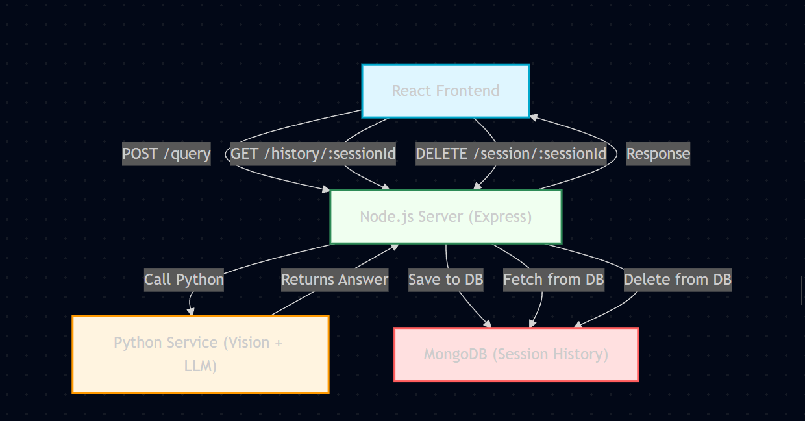

# AURA: Real-Time Visual Assistant for the Visually Impaired

---

# Demo

Watch the full walkthrough:  
[Google Drive Demo Link](https://drive.google.com/file/d/1HeL1yCGHQS6S_rS5jxug7HG0Da_UdaOj/view?usp=sharing)

Aura is a voice-based, AI-powered assistant that helps visually impaired users understand their surroundings using a webcam. It uses object detection, OCR, and Gemini LLM to answer questions about the scene — just like a human would.

---

## What is Aura?

Aura captures a **live frame** from a webcam whenever a user asks something like:

> "What is this?"  
> "Where is the door?"  
> "What does that label say?"

It analyzes the frame with AI and responds with accurate, confident answers — using memory, intelligent inference, and spoken output.

---

## Architecture

Here’s a visual overview of Aura’s full-stack architecture:

  

This architecture shows how the user’s voice triggers the system, which captures the camera frame, processes it via Python (YOLO + EasyOCR), constructs a smart prompt, and gets a natural response from Gemini — all in real-time.

---

## Tech Stack

| Layer              | Technologies                                           |
|-------------------|--------------------------------------------------------|
| Visual Processing | Python, YOLOv8, EasyOCR                                |
| LLM Reasoning     | Gemini API (Text-only, Basic Key)                      |
| Backend API       | Node.js, Express.js                                    |
| Data Storage      | MongoDB                                                |
| Frontend UI       | React, Web Speech API (SpeechRecognition, SpeechSynthesis) |

---

## Core Features

### 1. Real-Time Scene Understanding

Captures a webcam frame and describes what’s visible.

**Example:**  
**User**: “What do you see?”  
**Aura**: “There is a laptop in the center, a bottle on the left, and a chair behind the table.”

---

### 2. OCR + LLM Inference

Reads visible text and intelligently interprets it.

**Example:**  
**User Query**: What is this?  
**OCR Extracted**: `["Mucaine Gd", "Yio"]`  
**Aura's Response**: "This appears to be Mucaine Gel, a syrup used for acidity."

Aura never says the raw OCR text — it speaks like a human would.

---

### 3. Short-Term Visual Memory

Understands follow-up questions like “Now?” or “Where is it?” without re-stating the full query.

**Scenario:**

- **User**: "Where is the door?"  
- **Aura**: "No door found. Please move the camera."  
- (User adjusts view)  
- **User**: "Now?"  
- **Aura**: "The door is on the right side of the frame."

---

### 4. Query-Triggered Intelligence

Aura only analyzes the scene after a user asks a question.

- Reduces computation  
- Makes the interaction feel natural

---

### 5. End Session Cleanup

User can click “End Session” to clear session memory from MongoDB and reset Aura’s state.

---

## LLM Prompt Strategy

Aura uses a Chain-of-Thought (CoT) prompt pattern that adapts its behavior based on context:

| Condition                   | Behavior                          |
|----------------------------|-----------------------------------|
| User asks about scene/text | Uses visual and OCR context       |
| User asks general question | Answers with general knowledge    |
| OCR is messy or noisy      | LLM infers and answers confidently|

---

## Input Handling

Aura uses `cv2.VideoCapture(0)` to grab a live webcam frame for every voice query.

- It does not stream continuously  
- It captures only one frame when the user speaks

This ensures the system is efficient and responsive on any device.

---

## What’s Sent to Gemini

Each user query includes:

- Object list with position and distance (e.g., `"door": right, far`)  
- OCR extracted text  
- Last 2–3 turns of conversation history  
- Current user query  
- Instructions to use context only if relevant

Aura never tells the user what the raw OCR was — it always gives a clean, confident answer.

---

---

## Summary

Aura is a full-stack, real-time, voice-powered AI assistant that:

- Uses computer vision + OCR to understand the user’s environment  
- Responds using Gemini LLM, with memory and intelligent follow-up  
- Speaks naturally via Web Speech API  
- Stores session data in MongoDB with cleanup support  
- Built using modular architecture with React, Node.js, and Python  

---

Built with empathy.  
Shipped with tech.  
Ready for real-world impact.
